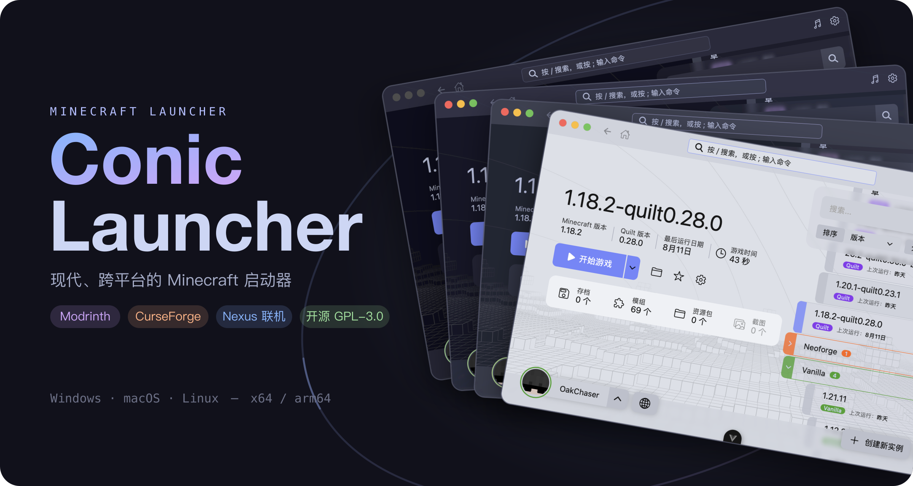
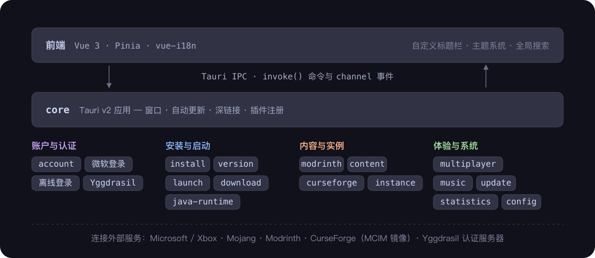

<div align="center">
  
  <p>
    <a href="https://github.com/conic-apps/launcher/actions/workflows/build.yml"></a>
    <a href="https://github.com/conic-apps/launcher/releases"></a>
    <a href="../../LICENSE"></a>
    
  </p>
  <p><strong>작고 빠르고 가벼운 Minecraft 런처</strong><br>
  멀티 인스턴스 관리 · 모드 및 리소스팩 마켓플레이스 · 크로스 LAN 멀티플레이 · 멀티 테마 지원</p>
  <p>
    🌐 <a href="../../README.md">English</a> · <a href="./README.zh_cn.md">简体中文</a> · <a href="./README.zh_tw.md">繁體中文</a> · <a href="./README.ja_jp.md">日本語</a> · <a href="./README.ko_kr.md"><strong>한국어</strong></a> · <a href="./README.de_de.md">Deutsch</a> · <a href="./README.fr_fr.md">Français</a> · <a href="./README.es_es.md">Español</a> · <a href="./README.pt_br.md">Português (Brasil)</a> · <a href="./README.ru_ru.md">Русский</a> · <a href="./README.tr_tr.md">Türkçe</a> · <a href="./README.pl_pl.md">Polski</a>
  </p>
</div>

---

## 이것이 무엇인가

Conic Launcher는 현대적인 데스크톱 Minecraft 런처입니다: 코어 로직은 Rust로 구현되었고, UI는 Tauri 2 + Vue 3로 구축되었습니다. 설치 용량이 작고, 시작이 빠르며, 리소스 소비가 적어 탄소 배출 감소에도 기여합니다.

인스턴스 생성, 로더 설치, 모드 검색, 친구 초대하여 함께 플레이, 게임 시작 및 플레이 시간 추적까지 — 전체 워크플로우를 하나의 앱에서 완료할 수 있습니다.

> 프로젝트는 현재 초기 알파 단계입니다. 기능과 UI가 빠르게 반복 개선되고 있으니, 자유롭게 사용해 보시고 피드백을 보내주세요.

## 기능

### 멀티 인스턴스 관리

모드 로더별로 그룹화된 인스턴스를 탐색하며, 정렬, 검색, 즐겨찾기를 지원합니다. 각 인스턴스에는 독립적인 설정, 맞춤 배경, 플레이 시간, 마지막 플레이 일시가 한눈에 보입니다.

https://github.com/user-attachments/assets/ad4678ee-8462-4e55-89f6-99aea41107cb

### 모든 주요 로더 지원

Minecraft 버전과 로더 버전을 선택하면 나머지는 런처가 처리합니다. Vanilla, Forge, NeoForge, Fabric, Quilt을 모두 지원하며, 설치 진행 상황을 실시간으로 표시합니다.

https://github.com/user-attachments/assets/73d28bc7-e743-4d16-b126-7b997eae797e

### 모드 및 리소스팩 마켓플레이스

Modrinth와 CurseForge 내장 검색: 프로젝트 상세 정보와 의존성 탐색, 번역된 요약문 읽기, 원클릭으로 모드나 리소스팩을 인스턴스에 설치. 로컬에 설치된 모드를 직접 관리할 수도 있습니다.

https://github.com/user-attachments/assets/78f9e850-473e-4587-92b4-c9bed78afb17

### Conic Nexus 크로스 LAN 멀티플레이

추가 도구 불필요: 그룹을 만들고, 초대 코드를 친구에게 공유하면 같은 월드에서 함께 플레이할 수 있습니다. 런처가 네트워크 환경(NAT 타입)을 감지하고 개선 제안을 제공합니다.


### 다양한 로그인 방식

Microsoft 계정 로그인(디바이스 코드 흐름), 오프라인 로그인, Authlib-Injector / Yggdrasil 외부 인증 서버를 지원합니다. 계정에는 3D 스킨 미리보기, 망토 표시, 스킨 업로드 기능이 있습니다.


### 편안한 시작 경험

시스템의 Java를 자동 스캔하고, 적합한 런타임을 자동으로 다운로드할 수도 있습니다. 메모리는 자동 할당됩니다(32비트 Java 상한 보호 포함). 시작 과정이 완전히 시각화됩니다: 게임 파일 다운로드, 로더 설치, 의존성 해결, 프로세스 시작 대기.

고급 사용자도 소외되지 않습니다 — JVM 가비지 컬렉터, JVM 인수, 게임 인수, 클래스패스, 래퍼 명령, 시작 전후 명령 실행이 모두 사용자 정의 가능합니다.

https://github.com/user-attachments/assets/1a6943f9-4e35-4391-9984-799cf42ee49d

### 저장 데이터 및 게임 자료

런처 내에서 저장 월드 맵 탐색, 데이터팩 및 리소스팩 관리, 게임 스크린샷 조회가 가능합니다.

https://github.com/user-attachments/assets/195afb69-8c9f-4d83-aa40-50e7b4d61788

### UI 및 개인 설정

4가지 Catppuccin 테마(Mocha · Macchiato · Frappé · Latte), 고대비 변형, 시스템 설정에 따른 라이트/다크 모드 자동 전환. 맞춤 런처 배경을 지원합니다. 로컬 음악 재생과 스펙트럼 시각화 기능이 있는 내장 음악 플레이어.

https://github.com/user-attachments/assets/5a262ff9-2ba8-45d4-b326-38f5d3911a80

https://github.com/user-attachments/assets/2847ea70-35e0-4ecc-9055-777f7545a260

### 그 외

- 앱 내 자동 업데이트, 게임 버전 업데이트 알림
- 멀티스레드 다운로드, 연결 수 및 속도 제한 조절, 미러 서버 및 시스템 프록시 지원
- 글로벌 검색(`;`)과 명령 팔레트
- 플레이 시간 추적 및 활동 캘린더

## 다운로드

[GitHub Releases](https://github.com/conic-apps/launcher/releases)에서 플랫폼에 맞는 설치 프로그램을 다운로드하세요:

| 플랫폼  | 아키텍처              | 형식                                  |
| ------- | --------------------- | ------------------------------------- |
| Windows | x64 · arm64           | MSI · NSIS 설치 프로그램 · 포터블 exe |
| macOS   | Apple Silicon · Intel | DMG                                   |
| Linux   | x64 · arm64           | deb · rpm · AppImage                  |

앱에 자동 업데이트가 내장되어 있어, 설치 후 수동 업그레이드가 필요 없습니다.

## 소스에서 빌드

[Rust 1.88+](https://rustup.rs/), [Node.js 24](https://nodejs.org/), [pnpm](https://pnpm.io/)가 설치되어 있는지 확인하고, [Tauri 사전 요구사항](https://tauri.app/start/prerequisites/)에 따라 각 플랫폼의 의존성을 준비하세요.

```bash
git clone https://github.com/conic-apps/launcher.git
cd launcher
pnpm install
pnpm tauri dev      # 개발 및 디버깅
pnpm tauri build    # 프로덕션 빌드
```

## 기여하기

[Issue](https://github.com/conic-apps/launcher/issues/new/choose)와 Pull Request(`dev` 브랜치 대상)를 환영합니다. 제출 전에 다음을 실행해 주세요:

```bash
pnpm check
```

## 아키텍처

<div align="center">
  
</div>

프론트엔드(Vue 3 + Pinia)는 Tauri IPC를 통해 Rust 기능과 통신합니다. `core`는 Tauri 앱 조립을 담당하며, 구체적인 기능은 도메인별로 `crates/*` 워크스페이스 모듈로 분리되어 독립적으로 발전하고 필요에 따라 조합됩니다.

## 라이선스

이 프로젝트는 [GPL-3.0](../../LICENSE)로 배포되며, GPLv3 제7조의 추가 조항이 적용됩니다:

1. 수정 버전을 배포할 때 원본과 구별할 수 있도록 합리적으로 소프트웨어 이름이나 버전 번호를 변경해야 합니다([GPL-3.0 §7(c)](../../LICENSE)에 해당). 소스 코드의 모든 프로젝트 이름 참조를 교체해야 합니다.
2. 소프트웨어에 표시된 저작권 고지를 제거해서는 안 됩니다([GPL-3.0 §7(b)](../../LICENSE)에 해당).
3. 누군가가 수신자와 계약 조건을 체결하고 책임을 지는 경우, 라이선서와 저자는 연대 책임을 지지 않습니다([GPL-3.0 §7(b)](../../LICENSE)에 해당).

## 감사의 글

- [Catppuccin](https://catppuccin.com) — 아름다운 파스텔 테마 팔레트
- bangbang93의 [BMCLAPI](https://bmclapi2.bangbang93.com/)와 [forge-install-bootstrapper](https://github.com/bangbang93/forge-install-bootstrapper) — 다운로드 가속화 및 Forge 설치 부트스트래핑
- [MCIM](https://mod.mcimirror.top) — CurseForge 번역 요약 및 미러 캐싱
- 제안과 피드백을 제공해 준 모든 플레이어 여러분

## 면책 조항

Conic Launcher는 공식 Minecraft 제품이 아니며, Mojang Studios에 의해 승인되거나 관련된 것이 아닙니다. "Minecraft"는 Mojang AB의 상표이며, 이 프로젝트에서의 Minecraft 브랜드 사용은 Mojang Studios의 <a href="https://www.minecraft.net/en-us/terms#terms-brand_guidelines">브랜드 및 에셋 가이드라인</a>을 준수합니다.
