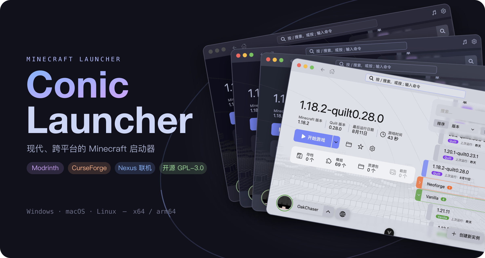

<div align="center">
  
  <p>
    <a href="https://github.com/conic-apps/launcher/actions/workflows/build.yml"></a>
    <a href="https://github.com/conic-apps/launcher/releases"></a>
    <a href="../../LICENSE"></a>
    <a href="https://discord.gg/xWKY5NMuf7"></a>
  </p>
  <p><strong>Маленький, быстрый и лёгкий лаунчер Minecraft</strong></p>
  <p>
    🌐 <a href="../../README.md">English</a> · <a href="./README.zh_cn.md">简体中文</a> · <a href="./README.zh_tw.md">繁體中文</a> · <a href="./README.ja_jp.md">日本語</a> · <a href="./README.ko_kr.md">한국어</a> · <a href="./README.de_de.md">Deutsch</a> · <a href="./README.fr_fr.md">Français</a> · <a href="./README.es_es.md">Español</a> · <a href="./README.pt_br.md">Português (Brasil)</a> · <a href="./README.ru_ru.md"><strong>Русский</strong></a> · <a href="./README.tr_tr.md">Türkçe</a> · <a href="./README.pl_pl.md">Polski</a>
  </p>
</div>

---

## Что это такое

Conic Launcher — это маленький, быстрый и лёгкий десктопный лаунчер Minecraft: основная логика реализована на Rust, а интерфейс построен на [Slint](https://slint.dev) — нативном UI-инструментарии. Он отличается малым размером установки, быстрым запуском и низким потреблением ресурсов, даже помогая сократить выбросы углерода.

От создания инстансов и установки загрузчиков до поиска модов и приглашения друзей для совместной игры, запуска игры и отслеживания игрового времени — весь рабочий процесс может быть завершён в одном приложении.

> Проект находится на ранней стадии альфа-тестирования. Функциональность и интерфейс развиваются быстро — не стесняйтесь пробовать и сообщать о проблемах.

## Возможности

### Управление несколькими инстансами

Просматривайте инстансы, сгруппированные по загрузчику модов, с сортировкой, поиском и избранным. Каждый инстанс имеет собственные настройки, индивидуальный фон, отслеживание времени игры и время последнего запуска.

https://github.com/user-attachments/assets/ad4678ee-8462-4e55-89f6-99aea41107cb

### Поддержка всех основных загрузчиков

Выберите версию Minecraft и версию загрузчика — лаунчер сделает всё остальное. Поддерживаются Vanilla, Forge, NeoForge, Fabric и Quilt с отображением прогресса установки в реальном времени.

https://github.com/user-attachments/assets/73d28bc7-e743-4d16-b126-7b997eae797e

### Маркет модов и ресурс-паков

Встроенный поиск Modrinth и CurseForge: просматривайте детали проекта и зависимости, читайте переведённые описания и устанавливайте моды или ресурс-паки в свои инстансы одним кликом. Также можно управлять локально установленными модами напрямую.

https://github.com/user-attachments/assets/78f9e850-473e-4587-92b4-c9bed78afb17

### Сетевое взаимодействие Conic Nexus

Не нужны дополнительные инструменты: создайте группу, поделитесь кодом приглашения с друзьями и присоединитесь к одному миру вместе. Лаунчер определяет вашу сетевую среду (тип NAT) и даёт рекомендации по улучшению.


### Несколько способов входа

Поддерживается вход через аккаунт Microsoft (поток кода устройства), оффлайн-вход и любой внешний сервер аутентификации Authlib-Injector / Yggdrasil. Аккаунты поддерживают 3D-предпросмотр скинов, отображение плащей и загрузку скинов.


### Беззаботный запуск

Автоматическое сканирование Java в системе или автоматическая загрузка подходящей среды выполнения. Память выделяется автоматически (с защитой от превышения лимита для 32-битной Java). Процесс запуска полностью визуализирован: загрузка файлов игры, установка загрузчиков, разрешение зависимостей и ожидание запуска процесса.

Продвинутые пользователи не забыты — сборщик мусора JVM, аргументы JVM, аргументы игры, classpath, команда-обёртка и команды до/после запуска — всё настраивается.

https://github.com/user-attachments/assets/1a6943f9-4e35-4391-9984-799cf42ee49d

### Сохранения и игровые данные

Просматривайте карты миров в сохранениях, управляйте пакетами данных и ресурс-паками, просматривайте скриншоты игры — всё прямо в лаунчере.

https://github.com/user-attachments/assets/195afb69-8c9f-4d83-aa40-50e7b4d61788

### Интерфейс и персонализация

Четыре темы Catppuccin (Mocha · Macchiato · Frappé · Latte), а также варианты с высокой контрастностью, с автоматическим переключением светлой/тёмной темы в соответствии с настройками системы. Поддерживаются пользовательские фоны лаунчера. Встроенный музыкальный проигрыватель с воспроизведением локальной музыки и визуализацией спектра.

https://github.com/user-attachments/assets/5a262ff9-2ba8-45d4-b326-38f5d3911a80

https://github.com/user-attachments/assets/2847ea70-35e0-4ecc-9055-777f7545a260

### И многое другое

- Встроенные автообновления и уведомления об обновлении версий игры
- Многопоточная загрузка с настраиваемым количеством соединений и ограничением скорости; поддержка зеркальных серверов и системного прокси
- Глобальный поиск (`/`) и палитра команд (`;`)
- Отслеживание игрового времени и календарь активности

## Скачать

Скачайте установщик для вашей платформы на [GitHub Releases](https://github.com/conic-apps/launcher/releases) или на [официальном сайте](https://conicmc.app):

| Платформа | Архитектура           | Форматы                                 |
| --------- | --------------------- | --------------------------------------- |
| Windows   | x64 · arm64           | MSI · портативный exe                   |
| macOS     | Apple Silicon · Intel | DMG                                     |
| Linux     | x64 · arm64           | deb · rpm · AppImage                    |

Приложение включает автообновления — после установки ручное обновление не требуется.

> Автономный Windows-`.exe` — это один файл, но он импортирует `VCRUNTIME140.dll`: на машине без Visual C++ Redistributable (на большинстве с Office или .NET он уже есть) он не запустится. `.msi` устанавливает тот же исполняемый файл.

## Сборка из исходного кода

Убедитесь, что установлен [Rust 1.88+](https://rustup.rs/); в Linux дополнительно установите [зависимости для сборки](../../CONTRIBUTING.md#linux-build-dependencies).

```bash
git clone https://github.com/conic-apps/launcher.git
cd launcher
cargo run              # Разработка и отладка
cargo build --release  # Продакшн-сборка
```

## Участие

Мы приветствуем вклад! Прочитайте [CONTRIBUTING.md](../../CONTRIBUTING.md), чтобы узнать, как начать, настроить среду разработки и отправить pull request.

## Архитектура

Интерфейс построен на [Slint](https://slint.dev) и напрямую связан с доменными crates — слоя IPC нет. `app/` содержит бинарник и дерево `.slint`; каждая возможность живёт в собственном модуле `crates/*` рабочего пространства, поэтому они развиваются независимо и комбинируются по мере необходимости.

Полная картина — корни хранилищ, слои приложения, структура UI и карта crates — в [ARCHITECTURE.md](../../ARCHITECTURE.md).

## Лицензия

Этот проект распространяется под лицензией [GPL-3.0](../../LICENSE) с дополнительными условиями по разделу 7 GPLv3:

1. При распространении модифицированных версий необходимо разумным образом изменить имя программного обеспечения или номер версии для его отличия от оригинала (в соответствии с [GPL-3.0 §7(c)](../../LICENSE)); необходимо заменить все упоминания названия проекта в исходном коде.
2. Нельзя удалять уведомления об авторском праве, отображаемые в программном обеспечении (в соответствии с [GPL-3.0 §7(b)](../../LICENSE)).
3. Если кто-то вступает в договорные условия с получателями и берёт на себя ответственность, лицензиар и авторы не несут солидарной ответственности (в соответствии с [GPL-3.0 §7(b)](../../LICENSE)).

## Благодарности

- [Catppuccin](https://catppuccin.com) — Красивая пастельная палитра тем
- [forge-install-bootstrapper](https://github.com/bangbang93/forge-install-bootstrapper) от bangbang93 — Загрузчик установки Forge
- [MCIM](https://mod.mcimirror.top) — Переведённые описания CurseForge и зеркальное кэширование
- Все игроки, которые предлагали идеи и обратную связь

## Отказ от ответственности

Conic Launcher не является официальным продуктом Minecraft и не одобрен и не аффилирован с Mojang Studios. «Minecraft» — это зарегистрированная торговая марка Mojang AB. Любое использование бренда Minecraft в этом проекте соответствует <a href="https://www.minecraft.net/en-us/terms#terms-brand_guidelines">Руководству по использованию бренда и активов</a> Mojang Studios.
